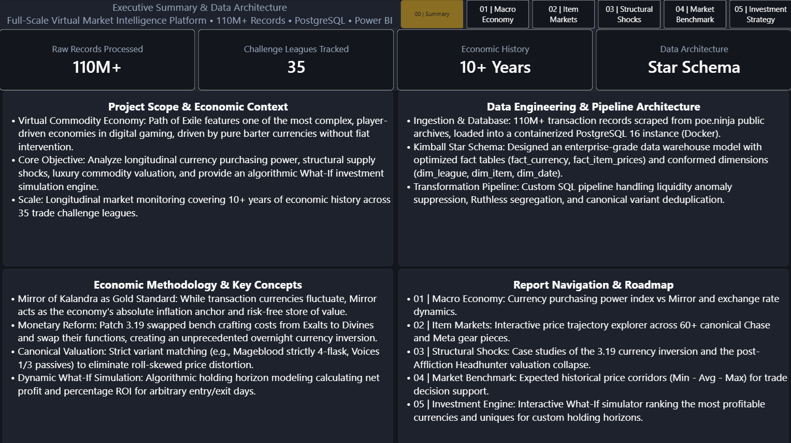
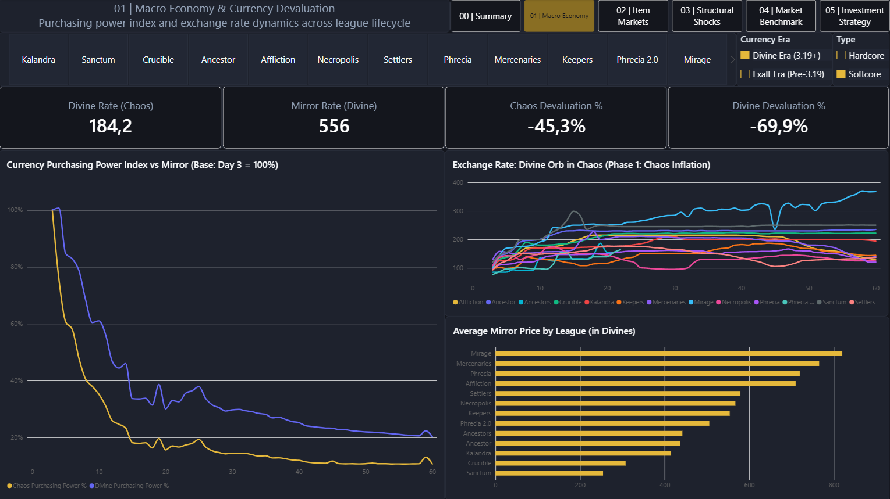
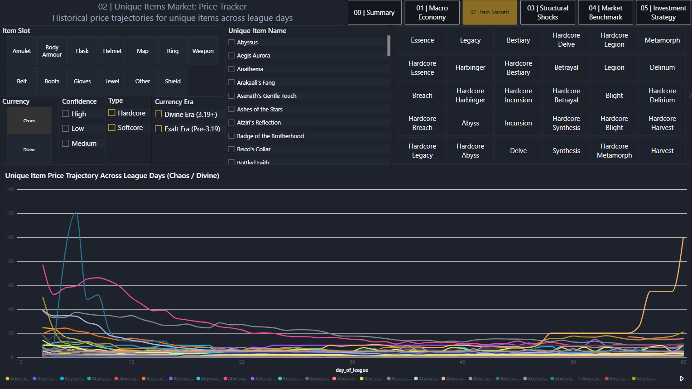
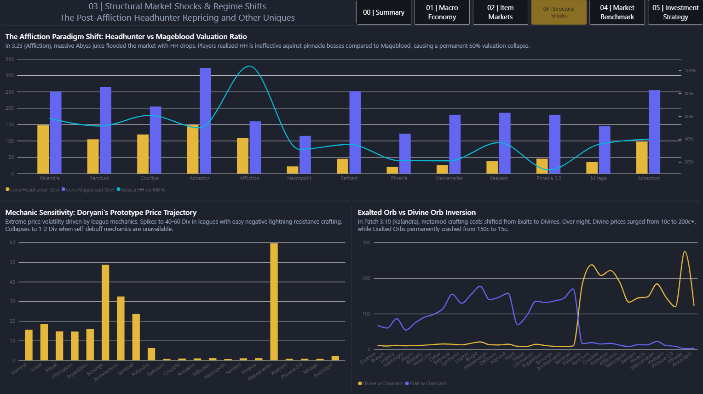
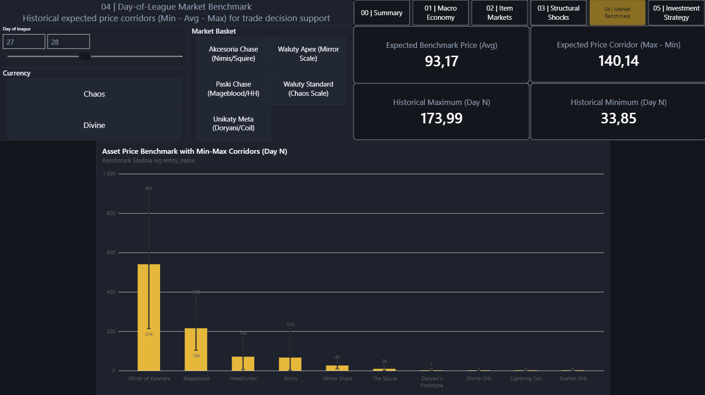
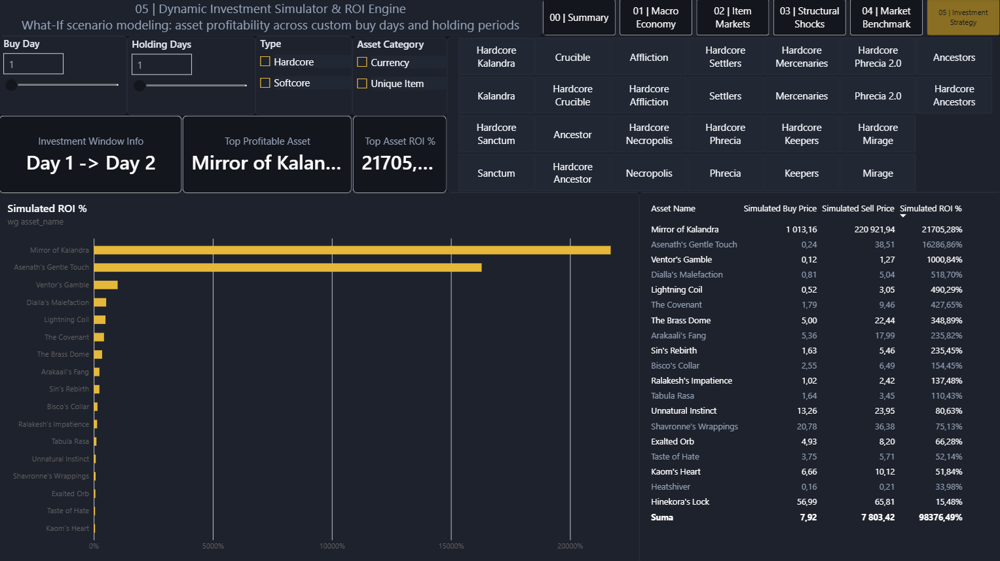

# 📈 Path of Exile Market Intelligence Platform (DWH & Power BI)
> **End-to-End Enterprise Analytics**: 110,000,000+ Raw Records Processed in PostgreSQL (Docker) & Visualized in Power BI

[](https://www.postgresql.org/)
[](https://www.docker.com/)
[](https://powerbi.microsoft.com/)
[](https://www.python.org/)
[](https://opensource.org/licenses/MIT)

---

## 📌 Executive Summary

Path of Exile (PoE) features one of the most sophisticated, player-driven virtual barter economies in digital gaming. Unlike conventional games with centralized fiat money (gold), PoE trades across a volatile matrix of utility orbs and luxury commodities.

This project delivers a full-stack **Market Intelligence Platform** analyzing **10+ years of economic history across 35 challenge leagues**. It tracks longitudinal purchasing power, structural balance shocks, and commodity price corridors, culminating in an algorithmic **What-If Investment Simulation Engine**.

---

## 🏗️ Data Architecture & Pipeline

```
+---------------------+      +------------------------+      +-------------------------------+
| Raw Trade Archives  | ---> |   ETL Ingestion Layer  | ---> |   PostgreSQL 16 (Docker DWH)  |
| 110M+ Records       |      |   Python (psycopg2)    |      |   Kimball Star Schema         |
| (poe.ninja dumps)   |      |   Chunked Batch Load   |      |   poe_market_dwh_pipeline.sql |
+---------------------+      +------------------------+      +-------------------------------+
                                                                             |
                                                                             v
+---------------------+      +------------------------+      +-------------------------------+
| Dynamic What-If     | <--- |   Analytical Views     | <--- |   Optimized Power BI Model    |
| Investment Engine   |      |   Currencies & Chase   |      |   VertiPaq In-Memory (Import) |
| ROI Simulation      |      |   Benchmark Corridors  |      |   Dynamic DAX & Dark Theme    |
+---------------------+      +------------------------+      +-------------------------------+
```

### 1. Kimball Star Schema
The data warehouse is modeled using classical dimensional design:
* **Fact Tables**:
  * `fact_currency`: Daily exchange rates between trade currencies and Chaos Orb base.
  * `fact_item_prices`: Daily transactional pricing for all unique commodities.
* **Dimensions**:
  * `dim_league`: Tracks 35 challenge leagues, calendar duration, release versions, and currency eras.
  * `dim_item`: Conformed catalog of unique items with slot categorization, rarity tiers (T0 Chase, T1 High, T2 Meta), and canonical variant flags.
  * `dim_date`: Conformed calendar dimension with day/week offsets and weekend flags.

### 2. Engineering Challenges Solved
* **Monetary Era Inversion (Patch 3.19)**: Modeled the structural break where Divine Orbs replaced Exalted Orbs as the primary high-tier currency via conformed `league_era` boundaries and `price_anchor_high` metrics.
* **Outlier & Liquidity Cleaning**: Handled non-standard game modes (segregated Ruthless leagues with extreme illiquid artifacts) and suppressed fake low-confidence listing anomalies.
* **Canonical Deduplication**: Filtered roll-distorted items (e.g., restricted Mageblood to 4-flask rolls, Voices to 1/3 socket variants) to avoid skewing commodity valuations.

---

## 📊 Dashboard Showcase (Power BI)

The executive dashboard is organized into 6 coherent analytical perspectives:

### 00 | Executive Summary & Data Architecture
An executive onboarding screen summarizing data scale, architectural decisions, and economic definitions.


---

### 01 | Macro Economy & Currency Devaluation
Longitudinal purchasing power curves relative to **Mirror of Kalandra** (the economy's Gold Standard), accompanied by exchange rate trajectories and cross-league inflation rankings.


---

### 02 | Unique Items Market (Price Tracker)
Interactive price trajectory explorer across 60+ canonical Chase and Meta gear pieces, filterable by equipment slot, confidence, and league lifecycle.


---

### 03 | Structural Market Shocks & Regime Shifts
Case studies of the two greatest structural shocks in game history:
1. **The Affliction Shift**: The supply flood of Patch 3.23 permanently demoting Headhunter from equal parity with Mageblood down to 15–25% valuation.
2. **The 3.19 Monetary Reform**: The overnight inversion of Exalted Orbs vs Divine Orbs.


---

### 04 | Day-of-League Market Benchmark
Tactical decision-support tool establishing historical expected price corridors (Minimum, Average, Maximum) for any arbitrary day of a league.


---

### 05 | Dynamic Investment Simulator & ROI Engine
Interactive **What-If scenario engine** allowing users to select an entry day (Buy Day) and holding horizon (Holding Days) to dynamically rank the most profitable currencies and unique items.


---

## 💡 Key Economic Findings

1. **The Dual-Phase Inflation Engine**:
   * **Phase 1 (Days 1–14)**: Rapid Chaos devaluation (-45% against Divine) as mapping currency generation floods the market.
   * **Phase 2 (Days 14–60)**: Severe Divine purchasing power loss (-70% against Mirror). Divine functions strictly as a transactional currency, while Mirror of Kalandra acts as the sole wealth-preservation safe haven.
2. **Permanent Regime Shift (Headhunter vs Mageblood)**:
   * Prior to 3.23 (Affliction), Headhunter traded at 50–60% of Mageblood value, reaching 100% parity during the Affliction wisp craze.
   * Following supply saturation and increased endgame emphasis on pinnacle bosses, Headhunter experienced a permanent 80% valuation collapse to 15–25 Divines, while Mageblood cemented its status as the supreme luxury asset (200–300 Divines).
3. **Optimal Early-League Capital Allocation**:
   * Capital deployed on Day 3 into endgame crafting commodities (Mirror Shards, Fracturing Shards, Awakener's Orbs) consistently yields 70–180% higher ROI by Day 14 compared to holding raw liquid Chaos or Divines.

---

## 🚀 How to Run Locally

### Prerequisites
* [Docker Desktop](https://www.docker.com/)
* [Power BI Desktop](https://powerbi.microsoft.com/) (Windows)
* Python 3.11+ (optional, for running scraping scripts)

### Step 1: Start the PostgreSQL Container
```bash
docker compose up -d
```

### Step 2: Build the DWH Pipeline
Connect to the database (`localhost:5433`, user: `poe_admin`, db: `poe_market`) and execute the automated pipeline script:
```bash
docker exec -i poe_market_db psql -U poe_admin -d poe_market < poe_market_dwh_pipeline.sql
```

### Step 3: Open the Power BI Report
Open `Analiza rynku POE.pbix` in Power BI Desktop to explore the full dashboard.

---

## 📂 Repository Structure

```
├── Analiza rynku POE.pbix        # Main Power BI Desktop Dashboard (6 Pages)
├── poe_market_dwh_pipeline.sql   # Production SQL DWH Transformation Pipeline
├── docker-compose.yml             # PostgreSQL 16 container definition
├── poe_dark_theme.json           # Custom Dark Executive UI theme
├── download_poe_data.py          # Data scraper for historical archives
├── load_data.py                  # High-performance chunked database loader
├── requirements.txt              # Python runtime dependencies
├── screenshots/                  # High-resolution dashboard previews
│   ├── 00_summary.png
│   ├── 01_macro_economy.png
│   ├── 02_item_markets.png
│   ├── 03_structural_shocks.png
│   ├── 04_market_benchmark.png
│   └── 05_investment_engine.png
├── .gitignore                    # Excludes multi-gigabyte raw datasets
└── README.md                     # Executive Documentation & Case Study
```

---

## 👨‍💻 Author & Contact
* **Project**: Path of Exile Market Intelligence Platform
* **Role**: Data Engineering & Business Intelligence
* **Technologies**: PostgreSQL, SQL (DWH / Kimball), Docker, Power BI, DAX, Python (Pandas/Psycopg2)
